Exploring the Impact of AI Tools on Stack Overflow: Post-ChatGPT Trends
================
Sophie Xu
March 14, 2025

### 1 Introduction

**1.1. Background**

This report examines the impact of AI-assisted coding tools on coding
discussion forums. Large language models (LLM) have rapidly gained
popularity and become integrated into daily life. In particular,
programmers now frequently use AI-assisted coding tools such as ChatGPT,
Gemini Code Assist, and GitHub Copilot in their workflows. The
capabilities of these AI tools drew widespread attention when ChatGPT
launched in November 2022, reaching over 100 million users within two
months (Wikipedia contributors, 2024). To capture the short-term trend
of this development, we restricted the analysis timeframe to 2021–2025,
allowing for a comparison before and after ChatGPT’s release.

**1.2 Dataset**

The analysis focuses on Stack Overflow’s public dataset, available
through the Stack Exchange API. Stack Overflow is one of the largest
question-and-answer platforms for programmers, with over 23 million
users and nearly 60 million posts as of March 2024 (Wikipedia
contributors, 2024). The API provides access to contents and
interactions on Stack Overflow through entities such as Answers, Badges,
and Comments (Stack Exchange, n.d.). For this study, we specifically
examine the Posts, Tags, and Users data. Posts include both questions
and answers, while Tags are the topics to categorize and organize
content (Stack Overflow Teams, 2024). These data offer valuable insights
into user engagement, content quality, and the evolving landscape of
Stack Overflow over time.

**1.3 Objective**

To investigate the impact of AI-assisted coding tools on coding
discussion forums, we focus on two key questions:

1.  Have AI tools reduced reliance on Stack Overflow for coding
    assistance?
2.  How have AI tools influenced the structure and content of forum
    posts?

By analyzing these aspects, we aim to infer the effects of ChatGPT’s
launch on Stack Overflow’s users and content, providing a preliminary
answer to the research question.

### 2 Methods

**2.1 Acquire Data**

The Stack Overflow’s public data was retrieved using the Stack Exchange
API v2.3. Since anonymous API users have a daily quota limit, we
registered for an API key (StackApps, n.d.). As instructed in the
documentation, custom filters were created through the API to extract
datasets with specific attributes. Once the desired filter was generated
as an encoded string, we pass it along with the other parameters,
`order`, `sort`, `site`, `fromdate`, `todate`, `page`, and `pagesize` to
the API request. To ensure an even distribution of posts from 2021 to
2025, we generated a sequence of start and end dates for each month
between 2021-01-01 and 2025-01-01, making separate requests for each
month. We fixed pagesize at 100 and merged the retrieved monthly data to
create a balanced dataset over the timeframe. For user data, we used a
timeframe from 2021-01-01 to 2024-04-01, constrained by API quota
limits. For tags, since the Stack Exchange database contains
approximately 65,000 tags, we retrieved the entire dataset without
filtering. In total, we collected three datasets—posts, users, and
tags—amounting to approximately 97 MB. The data was stored as CSV files
for easy reuse. The retrieval process was implemented using the `httr`
package in R.

**2.2 Data Cleaning and Wrangling**

2.2.1 Cleaning and Wrangling

To ensure the dataset was in a usable format, we first inspected and
summarized each dataset. We found that 93.77% of `location` data in the
users dataset and 0.94% of `owner_id` data in the posts dataset were
missing, while all other variables had complete data. Given the focus of
this analysis, we omitted the `location` variable but retained
`owner_id`. Next, we reviewed all variables, removing irrelevant ones
and renaming the rest for clarity. Exploratory visualizations revealed
highly correlated and duplicate variables, which we also removed.
Additionally, we identified two article entries in the posts dataset
that were neither questions nor answers and excluded them. Based on the
distribution and usage of tags, we decided to retain only the 100 most
popular tags for analysis.

We then consolidated variables into new variables tailored to our
question. We introduced `lifespan`, calculated as the time gap between
creation and last access/modification dates in both the users and posts
datasets. Based on the distribution of lifespan, reputation, and total
badge counts, we categorized users into three engagement levels:
“Expert”, “Experienced”, and “Normal”. Similarly, we classified posts
into three engagement levels based on lifespan, vote counts, and score:
“High”, “Moderate”, and “Low”. We also introduced a `quality` variable
for posts, categorizing them as: “Good”, “Normal”, “Bad”, and
“Controversial”.

2.2.2 Natural Language Processing (NLP)

The text content of posts was also classified into new categorical
variables. We identified error-related keywords (e.g., segmentation
fault), actionable language (e.g., fix), and contextual phrases (e.g.,
ASAP), combining these into a score to categorize a post’s `intention`
as either debugging or discussion. Similarly, we developed a
`complexity` score based on posts’ lengths, markdown structure, number
of technical terms, and vocabulary diversity, classifying posts as
either basic or complex. In addition, we tokenized the post body and
assigned one of the 100 most popular tags by matching tokens to tags and
selecting the highest-frequency match. We also applied LDA topic
modeling to determine whether a post was AI-related. Since NLP tasks are
computationally intensive, we stored the processed posts dataset as a
CSV file for efficient reuse. Lastly, we merged the users and posts
datasets using the post owner’s user ID, enabling analysis of user-post
relationships. Note the data cleaning and wrangling process used R
packages including `tidyverse`, `dplyr`, and `data.table`, while the NLP
tasks relied on `stringr`, `topicmodels`, and `tokenizers`.

**2.3 Visualization and Modeling**

For exploratory data analysis, we employed various visualizations,
including histograms, density plots, heatmaps, scatter plots, and bar
plots, to illustrate dataset distributions and correlations. For
statistical analysis, we transformed creation dates into daily and
quarterly intervals to compute post counts and analyze trends as a time
series. We applied linear regression models (LMs) and generalized
additive models (GAMs) to examine correlations. The findings were
primarily visualized using scatter plots and line plots. The
visualizations were created using R packages including `tidyverse`,
`ggplot2`, `ggcorrplot`, and `gridExtra`, while the modeling process
utilized `mgcv` .

### 3 Preliminary Results

**3.1 Exploratory Data Analysis**

3.1.1 Post

Most of the variables measuring engagement and quality in the users and
posts dataset exhibit strong skewness. Notably, 45.16% of posts are
active for less than 24 hours, while 9.07% are active for more than a
week. As illustrated in Figure 1, both distributions have a light, long
right tail, emphasizing this skewness.

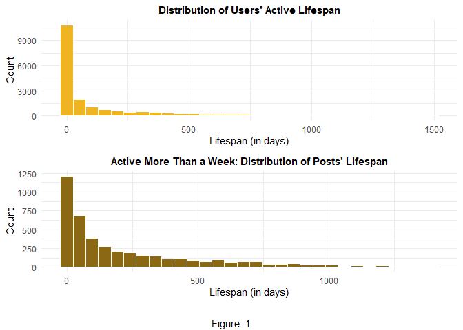

Only 5.65% of posts are controversial, meaning they receive a
significant number of both upvotes and downvotes. While one might expect
a negative correlation between upvotes and downvotes, Figure 2 suggests
otherwise. The line of best fit indicates that posts with more upvotes
tend to also receive more downvotes, possibly due to the polarizing
nature of controversial posts.

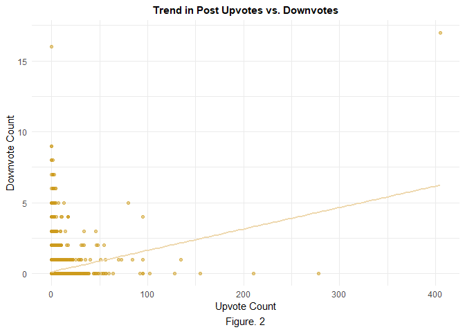

The skewness could be explained by the possibility that a small
proportion of basic, broadly useful questions generate high engagement,
while the majority of questions are niche-specific and engage only a
small subset of users. Additionally, controversial posts may attract
high engagement due to their inherently divisive nature.

3.1.2 User

A similar skewed distribution is observed in the users dataset. Users
are far more likely to upvote posts as a form of agreement or
encouragement, while only 0.04% have ever downvoted a post. Badge counts
also reflect this imbalance, up to the third quantile, users hold zero
silver or gold badges, as well as zero upvotes or downvotes. Likewise,
user reputation follows an extreme skew, with the minimum, median, and
third quantile all valued at 1, while the maximum reaches 4,341.
Interestingly, Figure 3 reveals a second mode in the reputation
distribution.

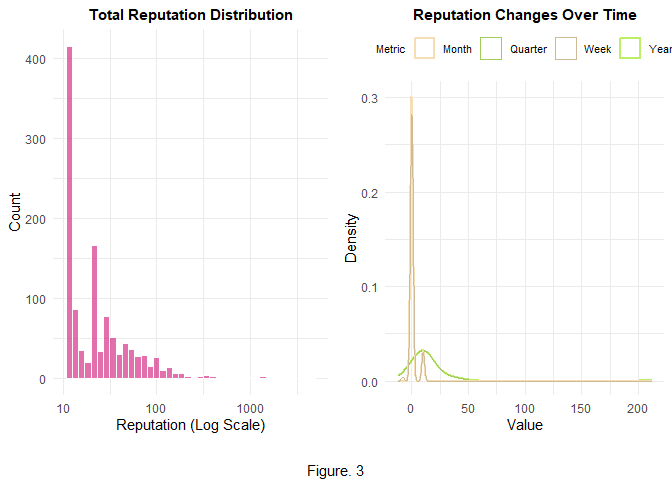

The density distribution of reputation changes over months nearly
coincides with weekly changes, and similarly, quarterly changes align
with yearly trends. This is supported by Figure 4, where the correlation
matrix shows that reputation changes over different time intervals are
highly correlated (\>0.95). Additionally, reputation is strongly
correlated with answer count (0.85) and silver badge count (0.68).

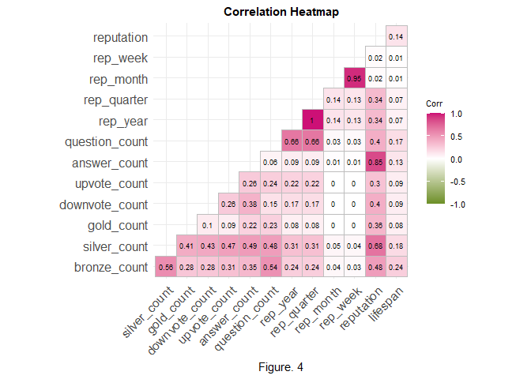

These findings suggest that a small percentage of users actively engage
in discussions, while the majority passively browse and search for
information.

3.1.3 Tag

The tags dataset is straightforward—the top 20 tags correspond to widely
used programming languages and concepts. JavaScript ranks first,
followed by Python and Java.

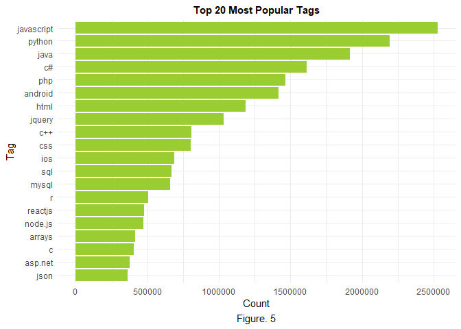

**3.2 Statistical Modeling**

3.2.1 Impact on Reliance

Recall we are interested in whether ChatGPT’s launch reduced
programmers’ reliance on Stack Overflow. Figure 6 shows a clear decline
in basic question posts since 2022. The linear model suggests that time
variables significantly impacted post counts ($p \approx 1.31e-4$).
Introducing the categorical variable (`turnpoint`) for posts before and
after November 2022 improved the model, with an adjusted R-squared of
0.394 ($p \approx 1.08e-6$). The GAM captures the non-linear trend,
explaining 66.8% of the variance ($p < 2e-16$). These results suggest a
decrease in basic coding questions, possibly due to the use of AI tools
instead of forums for basic coding help.

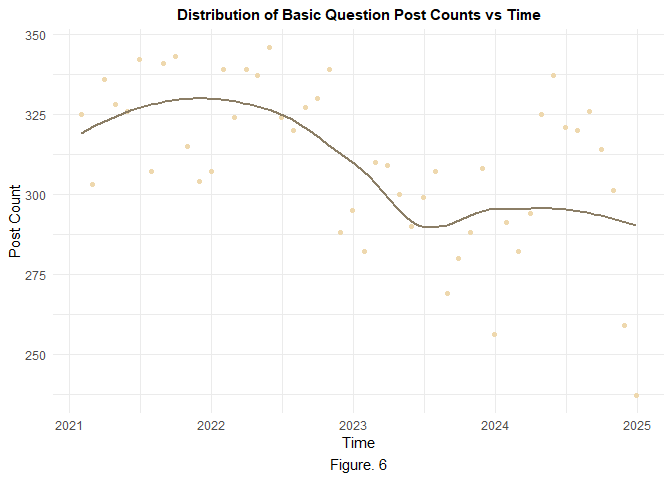

We also hypothesized that AI tools might reduce the number of normal
users posting questions. Figure 7 shows an increase in posts from 2022
to June 2023, followed by a sharp decline. The linear model with
interaction terms between time and user engagement indicates that time
($p \approx 0.015$), expert users ($p \approx 2.64e-5$), and their
interaction ($p \approx 4.03e-5$) significantly affect post counts. The
GAM model explains 60.4% of the variance, outperforming the linear
model. Note these results are based on the merged dataset instead of
full datasets, which may introduce sample bias due to its smaller size.

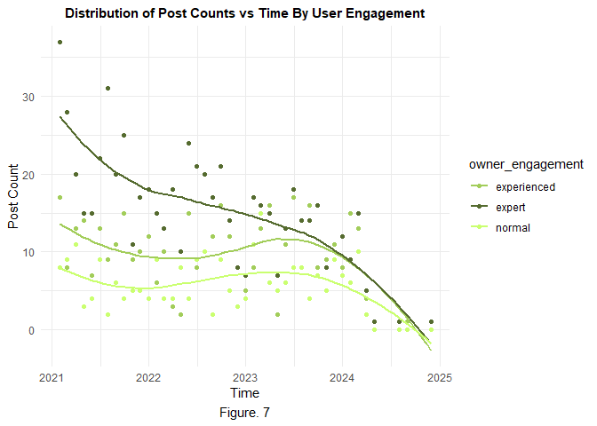

Additionally, we believe that the ratio of user types might have changed
due to the emergence of AI tools. Figure 8 shows the `toexperienced`
ratio ($\frac{\text{# experienced users}}{\text{# normal users}}$)
increased since 2022, while the `toexpert` ratio
($\frac{\text{# expert users}}{\text{# normal users}}$) decreased since
2021. Despite LM and GAM models showing high significance for
`toexpert`, neither could confirm the importance of AI tools in shifting
the `toexperienced` ratio.

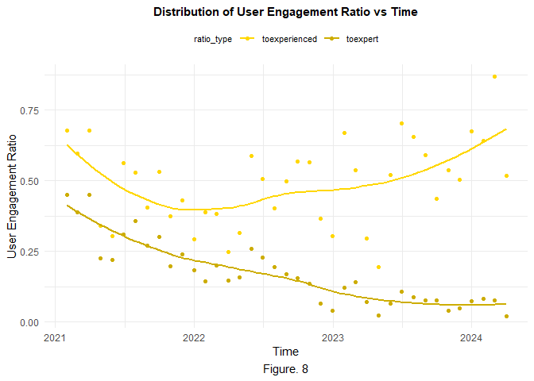

In summary, AI-assisted coding tools appear to have reduced reliance on
coding forums among beginner programmers but likely had no significant
impact on the engagement levels of advanced users.

3.2.2 Impact on Content Structure

We are also interested in exploring whether the use of LLM coding
assistance influenced forum post content. Figure 9 compares debugging
and discussion posts, showing a slight increase in normal debugging
posts since 2023, while other types remained stable. The distribution of
posts’ lengths is examined through a boxplot, which did not reveal
significant trends. Figure 10 illustrates a significant increase in the
ratio of complex to basic posts over time. The LM and GAM models all
indicate that the time variable and `turnpoint` significantly impact the
ratio ($p \approx 2.14e-12$, $p \approx 4.6e-11$, $p < 2e-16$,
respectively), explaining $R_\text{adj}^2 \approx 0.654$,
$R_\text{adj}^2 \approx 0.606$, and $R_\text{adj}^2 \approx 0.683$ of
the ratio’s variance. These findings suggest that LLM coding assistance
may have influenced post content by driving more complex inquiries.

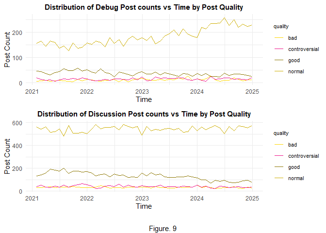

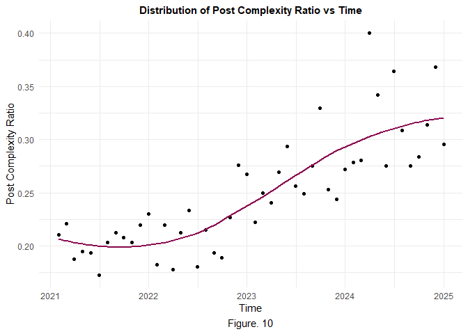

Figure 11 demonstrates the examination of the impact of AI tools on
posts in the top 10% of popular tags. It exhibits a significant decline
in posts about lists and an increase in posts about APIs around November
2022, and a decrease in posts about functions after a plateau from 2022
to 2024. The linear model with interaction terms for turnpoint and
specific tags indicates that the interactions between turnpoint and
tagapi ($p \approx 1.84e-5$) and turnpoint and taglist
($p \approx 1.72e-7$) are significant. The model explains 89.4% of the
variance in post counts. These results suggest that AI tools might have
encouraged programmers to rely on forums for more complex coding issues
(e.g., APIs), while simpler tasks (e.g., lists) are increasingly handled
by assistant tools.

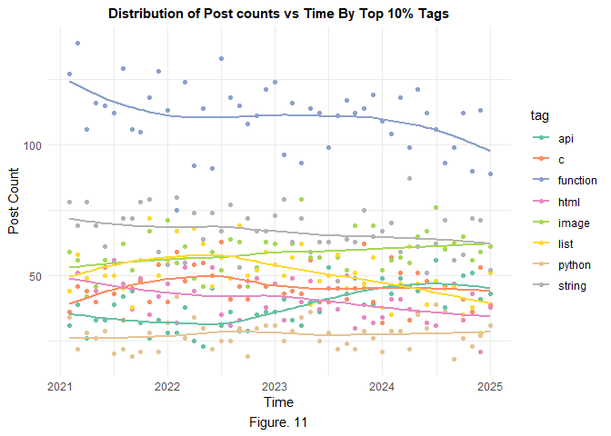

In conclusion, the emergence of AI-assisted coding tools appears to
encourage programmers to post more complex questions and discussions,
rather than basic inquiries.

### 4 Summary

**4.1 Discussion**

The analysis reveals a strong correlation between time, particularly
before and after November 2022, and posts’ complexity. These time points
influence the number of basic question posts, the ratio of complex to
basic posts, and post counts associated with specific tags. However, the
effects on activeness are mainly observed in normal users, while
experienced and expert users remain unaffected. This suggests that the
rise of AI-assisted coding tools may have reduced beginner programmers’
reliance on forums, while encouraging others to post more complex
questions and discussions. These findings infer that the emergence of AI
tools, notably after ChatGPT’s release, could be the confounding factor.
Future studies with data specifically on AI tool usage and causal
analysis methods are needed for more definitive conclusions.

**4.2 Planning**

For the final project, we plan to refine our models and improve
visualizations. Key areas for improvement include:

Modeling

1.  Regression: Explore model choices where the data better fits the
    corresponding model assumptions. For instance, Gamma GLM/GLMM for
    right-skewed data, and GAM with optimized parameter k.
2.  Classification: Utilize Python NLP packages or classification models
    to label post contents. For example, transformer models in Python,
    Random Forest and XGBoost.

Visualization

1.  Interactivity: Introduce features like data filtering, hovering for
    exact values, and time interval sliders for dynamic plots.
2.  Diversity: Choose effective plots for communication, with thoughtful
    color choices for clarity. For example, a combination of column and
    line timeline or bubble plot to illustrate correlation, dot plot or
    population pyramid to show distribution, and candlestick or
    streamgraph to demonstrate change over time.

### References

Stack Exchange. (n.d.). *Stack Exchange API documentation*.
<https://api.stackexchange.com/docs>

StackApps. (n.d.). *StackApps OAuth registration*.
<https://stackapps.com/apps/oauth/register>

Wikipedia contributors. (2024, March 10). *ChatGPT*. Wikipedia.
<https://en.wikipedia.org/wiki/ChatGPT>

Wikipedia contributors. (2024, March 10). *Stack Overflow*. Wikipedia.
<https://en.wikipedia.org/wiki/Stack_Overflow>

Stack Overflow Teams. (2024, March 10). *Content tags on Stack
Overflow*.
<https://stackoverflowteams.help/en/articles/8872158-content-tags>
